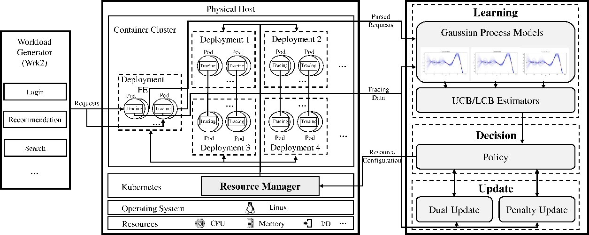

# POBO: Safe and Optimal Resource Management for Cloud Microservices
This repository is an artifact for the paper: `POBO: Safe and Optimal Resource Management for Cloud Microservices`[(pdf)](https://www.sciencedirect.com/science/article/abs/pii/S0166531623000469) by Hengquan Guo*, Hongchen Cao*, Jingzhu He, Xin Liu, and Yuanming Shi (* both are leading authors) at Shanghaitech. The paper is published at **the 41st International Symposium on Computer Performance, Modeling, Measurements and Evaluation(Performance), November 2023**.

Resource management in microservices is challenging due to the uncertain latency-resource relationship, dynamic environment, and strict Service-Level Agreement (SLA) guarantees. This paper presents a Pessimistic and Optimistic Bayesian Optimization framework, named POBO, for safe and optimal resource configuration for microservice applications. POBO leverages Bayesian learning to estimate the uncertain latency-resource functions and combines primal-dual and penalty-based optimization to maximize resource efficiency while guaranteeing strict SLAs. We prove that POBO can achieve sublinear regret and SLA violation against the optimal resource configuration in hindsight. We implemented a prototype of POBO and conducted extensive experiments on a real-world microservice application. Our results show that POBO can find the safe and optimal configuration efficiently, outperforming Kubernetes' built-in auto-scaling module and the state-of-the-art algorithm.

## Overview
When receiving a request from the user, POBO sends the request to the **Learning** module to estimate the request latency w.r.t. a variety of resource configurations. The **Decision** module  determines the best resource configuration for the request and adjusts the number of containers via the resource manager. After the request is completed, POBO collects the feedback, including Service-Level Agreement (SLA) violation and tail latency, which is used to update **Learning** and **Decision** modules for the next period.


## Setup environment
- A Kubernetes cluster with the microservice system in [DeathstarBench](https://github.com/delimitrou/DeathStarBench)
- Python environment according to [environment.yml](./environment.yml)
- To enable and test HPA please follow [the offical documentation](https://kubernetes.io/docs/tasks/run-application/horizontal-pod-autoscale-walkthrough/) 
- To monitor the overhead of Jaeger, please install [Prometheus](https://prometheus.io/) on k8s cluster

## Modules in POBO
We implement different modules of POBO in separate Python scripts as follows:

- [Algorithm](./algo.py): Main algorithm of POBO, including **Learning** and **Decision** module. We also implement the baseline CKB in this script.
- [Jaeger Collector](./jaegerCollector.py): We use Jaeger to implement end-to-end distributed tracing. POBO collects tracing data by leveraging Jaeger's exposed RESTful APIs. To change the sampling rate please refer to [DeathstarBench Documentation](https://github.com/delimitrou/DeathStarBench)
- [Resource Manager](./k8sManager.py): We implement the pod number controller by leveraging the Kubernetes Python client.
- [Workload Generator](./wrk2LoadGenerator.py): We use the commonly used HTTP benchmarking tool wrk2~\cite{wrk2} as the workload generator to send three types of requests, i.e., login, search, and recommendation, to the application. Wrk2 provides APIs for setting different thread numbers, the number of HTTP connections, the number of requests, the duration, and etc. You can change these parameters according to your cluster configuration.


## Experiments
### Single-type Request
Run the following command and POBO will start work:
```bash
python -m AE.simple.run
```

#### Resource usage and SLAs
Change the value of `task` variable in [paras.json](paras.json) to test different requests.

#### Latency-resource function learning
For the latency-resource function POBO learned, `mugG` and `sigmaG` in [Algorithm](./algo.py) is the estimated mean and variance of P90 tail latency.

#### Sensitivity study
For the sensitivity study, you can change the value of `obj_xxx` variable in [paras.json](paras.json).


### Multi-type Request
Run the following command and POBO will start work:
```bash
python -m AE.simple.runMulti
```

Change the value of `mult_dist` variable in [paras.json](paras.json) to test different distributions, including all experiment settings for multi-type requests.

## Citation
If you use POBO in your research, please cite the paper as follows.
```
@inproceedings{guo2023pobo
title={POBO: Safe and Optimal Resource Management for Cloud Microservices},
author={Hengquan Guo and Hongchen Cao and Jingzhu He and Xin Liu and Yuanming Shi},
booktitle={19th International Symposium on Computer Performance, Modeling, Measurements and Evaluation, Chicago, USA, November 14-17, 2023},
year={2023},
}
```

